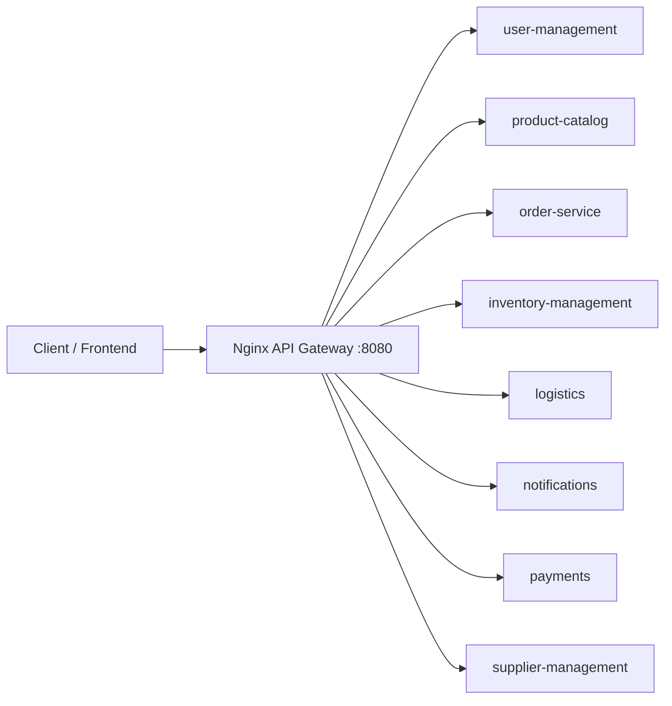
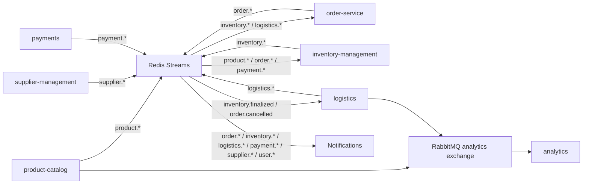

# B2B Backend Architecture

This backend is organized as independently deployable Rust services with a shared operating shell. Each service owns its data, publishes business events, and exposes a focused HTTP API. The root workspace and Compose stack make local development behave like one backend without collapsing service boundaries.

## Service Map

| Service | Port | Database | Primary Role |
| --- | ---: | --- | --- |
| `user-management` | `3004` | `users` | Identity, signin, protected profile actions |
| `product-catalog` | `3003` | `products` | Product CRUD, search, asset metadata |
| `order-service` | `3005` | `orders` | Order lifecycle and order state |
| `inventory-management` | `3006` | `inventory` | Stock, reservations, reservation expiration |
| `logistics` | `3008` | `logistics` | Shipment orchestration and tracking |
| `notifications` | `3009` | `notifications` | Durable notification outbox and delivery |
| `payments` | `3010` | `payments` | Idempotent payment intents and provider webhook state |
| `supplier-management` | `3011` | `suppliers` | Supplier onboarding and tenant lifecycle |
| `analytics` | `3007` | `analytics_service` on TimescaleDB | Event ingestion and rollups |

## Request Path



## Event Path



## Business Workflows

### Product Sync

1. Supplier creates or updates a product in `product-catalog`.
2. Product service emits `product.created`, `product.updated`, or `product.deleted`.
3. Inventory service listens and mirrors inventory rows.
4. Analytics records the event.

### Order Fulfillment

1. Customer creates an order in `order-service`.
2. Order service emits `order.created`.
3. Inventory reserves stock and emits one of:
   - `inventory.reserved`
   - `inventory.rejected`
   - `inventory.reservation_expired`
4. Order service updates the order status from inventory feedback.
5. Payments creates or reuses an idempotent payment intent for the order.
6. Payments emits `payment.success`, `payment.failed`, or `payment.cancelled` from manual status changes or provider webhooks.
7. Inventory finalizes the reservation on `payment.success`, or releases it on `payment.failed` / `payment.cancelled`.
8. Logistics creates a shipment only after `inventory.finalized`.
9. Logistics emits shipment updates.
10. Notifications converts important events into user/supplier notifications.

### Payment Processing

1. A caller creates a payment intent through `payments` with an `idempotency_key`, `order_id`, `user_id`, `supplier_id`, `product_id`, `quantity`, and amount.
2. Repeating the same idempotency key returns the same stored intent instead of creating duplicates.
3. Provider webhooks update the payment intent by `idempotency_key` or `provider_reference`.
4. `payment.success` drives inventory finalization and notification creation.
5. `payment.failed` and `payment.cancelled` drive reservation release and notification creation.

### Supplier Onboarding

1. A supplier is created through `supplier-management`.
2. The service emits `supplier.created` into `stream:suppliers`.
3. Status changes emit `supplier.status_updated`.
4. Notifications consumes supplier events and creates owner/supplier-facing notification rows.

## Scaling Strategy

### Horizontal Scaling

Use horizontal scaling for stateless HTTP services:

```bash
docker compose up --build --scale product-catalog=3 --scale order-service=2
```

Good candidates:

- `product-catalog`
- `user-management`
- `order-service` HTTP API
- `logistics` HTTP API
- `notifications` HTTP API
- `payments`
- `supplier-management`

Services that include Redis Streams background consumers can scale by sharing a consumer group, but each replica needs a stable unique `CONSUMER_NAME`. Redis Streams distribute messages across consumers in the same group instead of broadcasting every message to every replica.

### Vertical Scaling

Use vertical scaling when a single replica is CPU or memory constrained. In this codebase, vertical scaling is most useful for:

- `analytics`, because TimescaleDB rollups and event aggregation can become CPU/memory intensive.
- Postgres and TimescaleDB, because database performance usually becomes the platform bottleneck first.

### Database Scaling

Short-term:

- Add indexes around query paths.
- Tune SQLx pool sizes per service.
- Keep each service database separate.
- Use read replicas for heavy read/reporting workloads.

Long-term:

- Move analytics reads away from operational databases.
- Add partitioning for high-volume tables.
- Use outbox/event tables for exactly-once-ish publication.

## Reliability Concepts Added

- Root `Cargo.toml` workspace for one-command builds/checks.
- Root `docker-compose.yml` for shared Redis, RabbitMQ, Postgres, TimescaleDB, services, and API gateway.
- Nginx gateway as a local load-balancing/reverse-proxy boundary.
- Notifications outbox table with retryable delivery state.
- Health endpoints for logistics and notifications.
- Idempotent shipment creation by `order_id`.
- Redis Streams consumer groups for workflow consumers.
- Prometheus `/metrics` endpoints and OpenTelemetry tracing initialization.
- Payment intents with idempotency keys and webhook state transitions.
- Supplier onboarding service for tenant lifecycle beyond basic user roles.

## Recommended Next Backend Upgrades

- Keep Redis Streams for workflow events, and consider Kafka when retention/replay/audit needs exceed Redis.
- Add an outbox table per write-heavy service if event publication must survive process crashes after database commits.
- Forward gateway auth identity headers such as `X-User-Id` and `X-User-Role` into upstream services that need tenant-aware authorization.
- Add per-service OpenTelemetry span attributes for tenant, supplier, order, payment, and shipment identifiers.
- Add dead-letter handling for repeatedly failing Redis Stream entries.
- Add payment provider adapters for Stripe, Paystack, Flutterwave, or bank transfer reconciliation.
