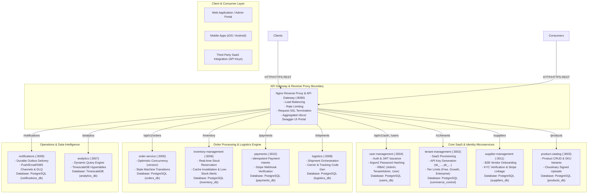
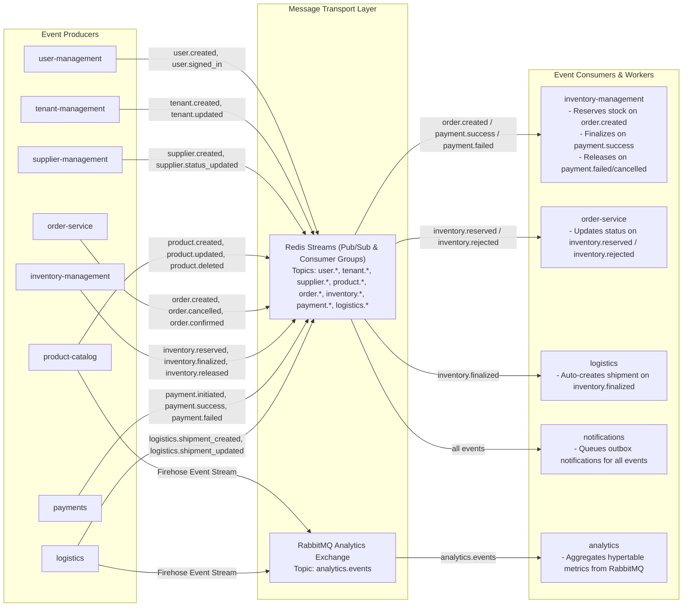
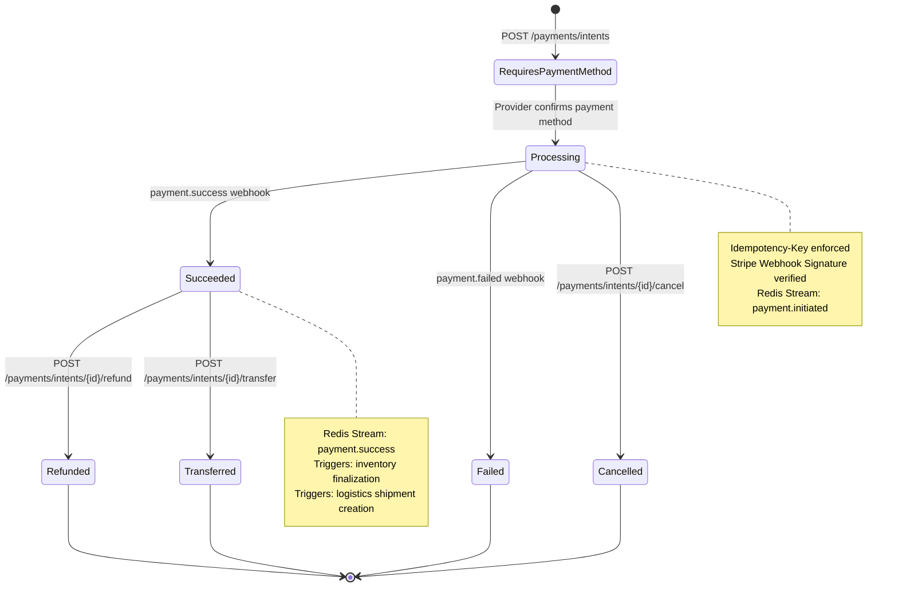
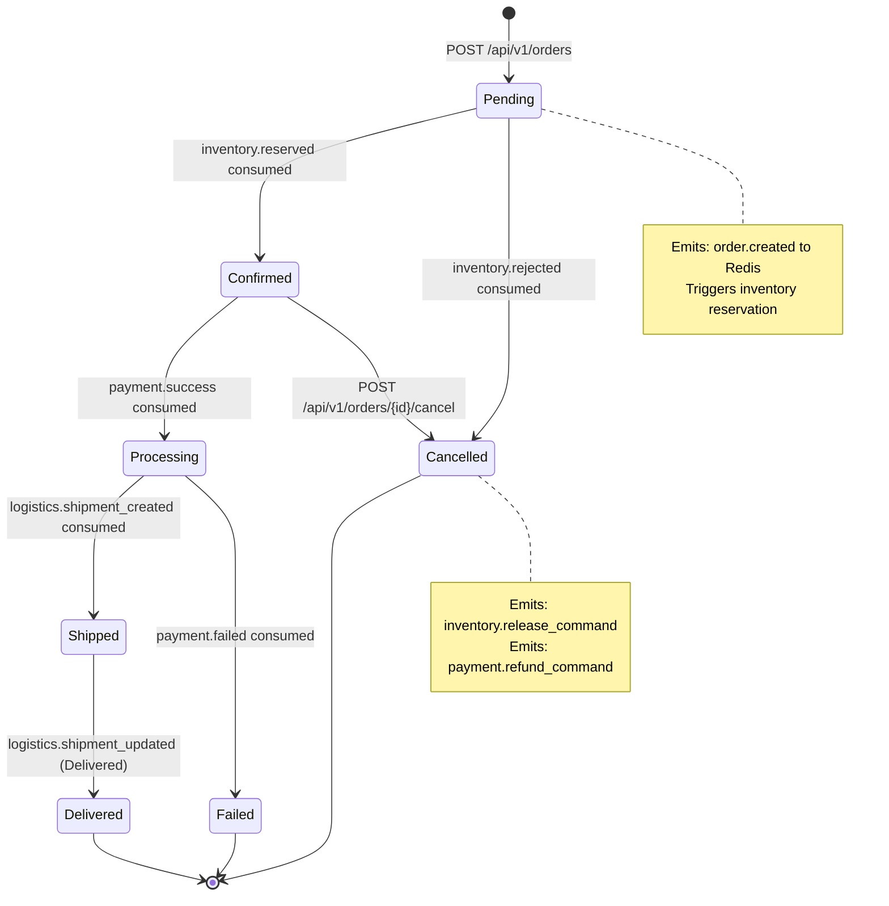
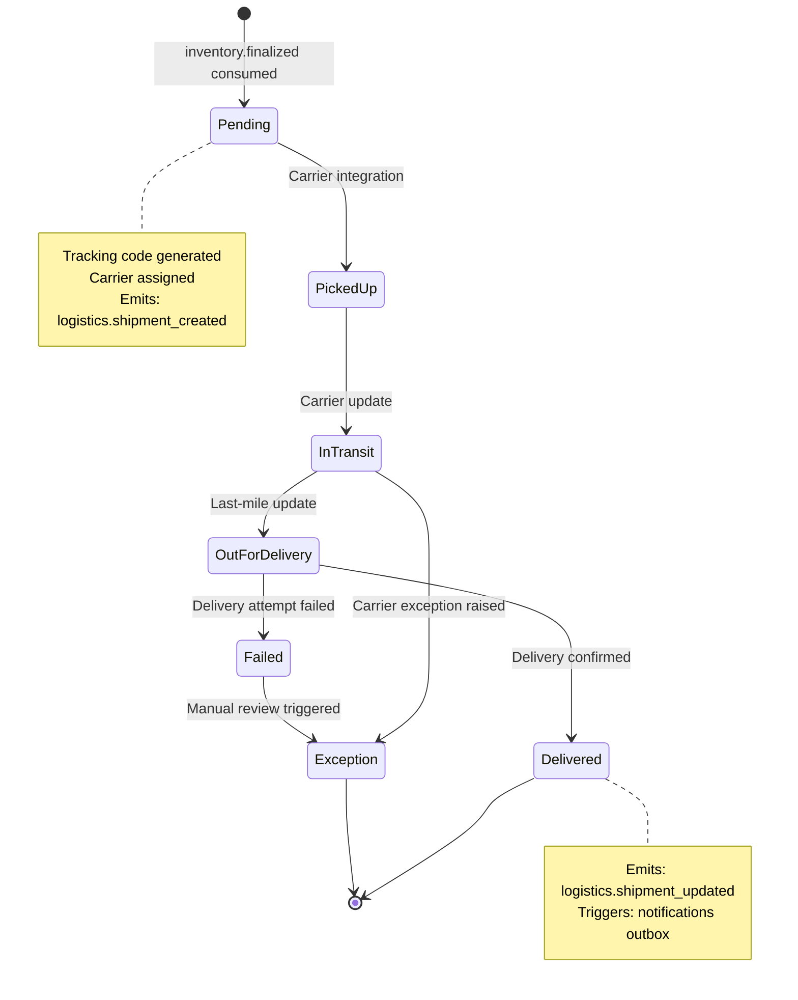
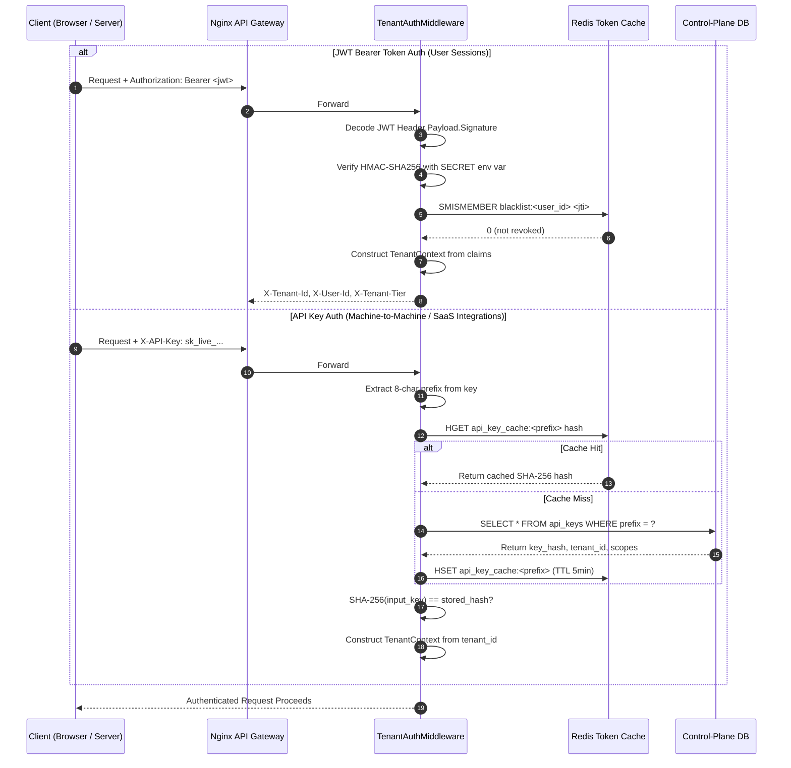
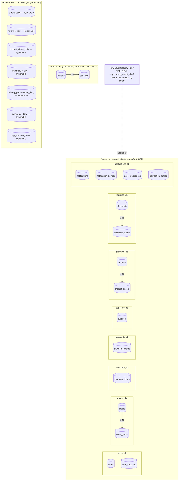
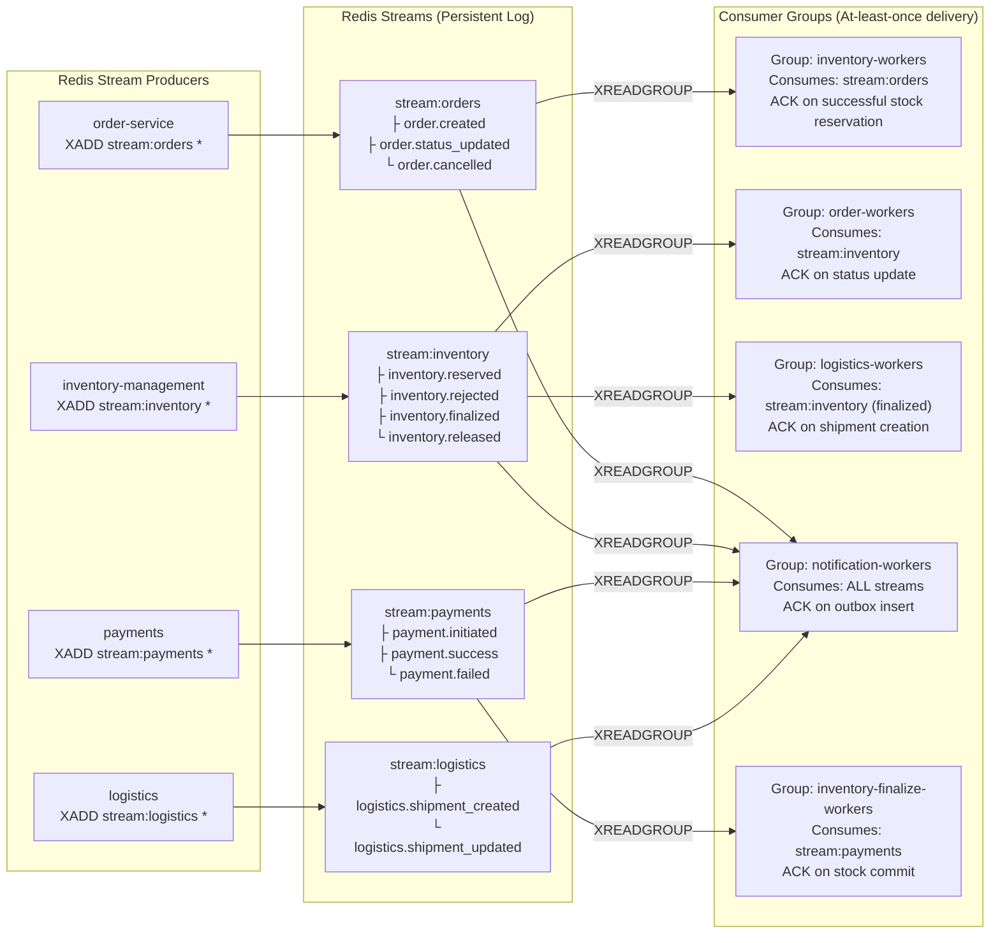

# B2B SaaS Rust Microservices Backend

> High-performance, multi-tenant B2B E-Commerce & SaaS backend built with Rust (Actix-web), PostgreSQL, TimescaleDB, Redis Streams, and RabbitMQ microservice architecture.

---

## 📌 About The Project

This repository hosts an event-driven, production-grade microservices backend engineered for B2B e-commerce and SaaS platforms. Built with **Rust (Actix-web)**, it implements multi-tenant isolation, high-throughput asynchronous event flows, idempotent payment processing, inventory reservation, and real-time logistics tracking.

### Key Architectural Highlights
- 🦀 **Pure Rust Workspace**: High throughput, zero-cost abstractions, memory safety, and minimal execution overhead.
- 🏢 **Multi-Tenant SaaS Architecture**: Row-Level Security (RLS), tenant isolation, tier-based feature flags, and custom domain mapping.
- ⚡ **Event-Driven Workflows**: Asynchronous message passing powered by Redis Streams consumer groups and RabbitMQ exchanges.
- 💳 **Idempotent Payment Intents**: Resilient payment state machine with webhook handling (Stripe, Paystack, bank transfers).
- 📊 **Analytics & Reporting**: Financial rollups and high-volume event aggregation stored in TimescaleDB.
- 🛡️ **Enterprise Security & Observability**: JWT authentication (Argon2), distributed OpenTelemetry tracing, and Prometheus metrics.

---

## 🏷️ GitHub Topics (Tags)
`rust` • `microservices` • `actix-web` • `b2b-saas` • `e-commerce-backend` • `multi-tenancy` • `event-driven` • `redis-streams` • `rabbitmq` • `timescaledb` • `postgresql` • `swagger-ui` • `openapi3` • `tokio` • `opentelemetry`

---

## 📐 System Architecture

### High-Level System Architecture & Request Routing



### Event Streaming, Message Bus & Asynchronous Workflows



---

### 💳 Payment Intent State Machine


---

### 📦 Order Lifecycle State Machine


---

### 🚚 Shipment Delivery State Machine


---

### 🔐 Dual Authentication Flow (JWT + API Key)


---

### 🗄️ Per-Service Database Architecture


---

### ⚡ Redis Streams Consumer Group Architecture


---

## 📊 Microservices Summary Table

| Service | Port | Database | Primary Role | Event Streams / Bus |
| :--- | :---: | :--- | :--- | :--- |
| **`platform`** | N/A | Shared Kernel | Common types, telemetry, Redis stream drivers, RLS | N/A |
| **`user-management`** | `3004` | PostgreSQL (`users`) | Auth (JWT/Argon2), RBAC, user profiles | Emits `user.*` |
| **`tenant-management`** | `3002` | PostgreSQL (`tenants`) | Tenant provisioning, domain mapping, subscription limits | Emits `tenant.*` |
| **`supplier-management`**| `3011` | PostgreSQL (`suppliers`) | Supplier onboarding, KYC verification, vendor settings | Emits `supplier.*` |
| **`product-catalog`** | `3003` | PostgreSQL (`products`) | SKUs, categories, multi-tenant inventory specs | Emits `product.*`, RabbitMQ firehose |
| **`order-service`** | `3005` | PostgreSQL (`orders`) | Order lifecycle, price calculation, status machine | Consumes `inventory.*`, Emits `order.*` |
| **`inventory-management`**| `3006` | PostgreSQL (`inventory`) | Stock allocation, reservation expiration, finalization | Consumes `order.*`/`payment.*`, Emits `inventory.*` |
| **`payments`** | `3010` | PostgreSQL (`payments`) | Idempotent payment intents, provider webhooks | Emits `payment.*` |
| **`logistics`** | `3008` | PostgreSQL (`logistics`) | Shipment orchestration, tracking codes, carrier updates | Consumes `inventory.finalized`, Emits `logistics.*` |
| **`notifications`** | `3009` | PostgreSQL (`notifications`) | Outbox pattern delivery (Email/SMS/In-App) | Consumes all stream events |
| **`analytics`** | `3007` | TimescaleDB | Event rollups, top products, financial summaries | Consumes RabbitMQ analytics exchange |

---

## 🔍 Detailed Microservices Breakdown

### 1. `order-service`
* **Role**: B2B Order creation, optimistic concurrency control, price calculation, item line management, state machine transitions (`Pending` -> `Confirmed` -> `Processing` -> `Shipped` -> `Delivered` / `Cancelled` / `Failed` / `Refunded`), and cancellation workflows.
* **Architecture Pattern**: Layered Actix-web service with Optimistic Concurrency Versioning + Redis Streams consumer & producer (`stream:orders`).
* **Storage / Message Bus**: PostgreSQL (`orders` DB, tables `orders`, `order_audit_logs`), Redis Streams (`order.created`, `order.confirmed`, `order.failed`, `order.cancelled`, `order.shipped`, `order.delivered`, `order.refunded`, `inventory.release_command`, `payment.refund_command`, `logistics.shipment_preparation_command`).
* **Key Endpoints**:
  * `POST /orders` - Create a new order (calculates expiration, sets version 1)
  * `GET /orders/{id}` - Fetch order details & items by UUID
  * `PUT /orders/{id}/status` - Optimistically update order status (verifies version & valid status transition matrix)
  * `DELETE /orders/{id}/{user_id}` - Delete order (allowed for unfulfilled orders)
  * `GET /health` / `GET /metrics`
* **Request/Response Models**: `CreateOrderRequest`, `UpdateOrderStatus`, `Order`, `OrderEvent`, `OrderStatus` (`Pending`, `Confirmed`, `Processing`, `Shipped`, `Delivered`, `Cancelled`, `Failed`, `Refunded`).
* **Event Flows**: Emits `order.created` upon creation; listens to `inventory.reserved` / `inventory.rejected` to transition state; emits `inventory.release_command` and `payment.refund_command` on cancellation/failure; emits `logistics.shipment_preparation_command` on confirmation.
* **OpenAPI Status**: ✅ Active — Swagger UI at `/swagger-ui/` · OpenAPI spec at `/api-docs/openapi.json`

---

### 2. `inventory-management`
* **Role**: Real-time multi-tenant product stock tracking, inventory reservation upon order placement, stock release on payment/order failure, stock finalization on payment success, low-stock threshold alerting, and cache invalidation.
* **Architecture Pattern**: Layered Actix-web service + Redis Streams background worker + Redis Multiplexed Cache Invalidation.
* **Storage / Message Bus**: PostgreSQL (`inventory` DB, RLS per transaction), Redis Streams consumer (`order.created`, `payment.success`, `payment.failed`, `payment.cancelled`, `product.created`, `product.updated`, `product.deleted`), publisher (`inventory.reserved`, `inventory.rejected`, `inventory.finalized`, `inventory.released`, `inventory.updated`, `inventory.lowstock`, `inventory.deleted`).
* **Key Endpoints**:
  * `GET /inventory/supplier/{supplier_id}` - Get inventory items by supplier ID
  * `POST /inventory` - Create initial stock level & product mapping
  * `GET /inventory/supplier/{supplier_id}/product/{product_id}` - Query specific product stock item
  * `PUT /inventory/supplier/{supplier_id}/stock` - Update stock quantity & trigger low-stock checks
  * `DELETE /inventory/supplier/{supplier_id}/product/{product_id}` - Remove product from inventory
  * `GET /health` / `GET /metrics`
* **Request/Response Models**: `CreateInventoryRequest`, `UpdateStockRequest`, `StockUpdateEvent`, `ProductDeletedEvent`, `InventoryItem`.
* **Event Flows**: Listens to `order.created` to reserve stock; publishes `inventory.reserved` or `inventory.rejected`; finalizes stock allocation on `payment.success`; releases reserved stock on `payment.failed` or `order.cancelled`.
* **OpenAPI Status**: ✅ Active — Swagger UI at `/swagger-ui/` · OpenAPI spec at `/api-docs/openapi.json`

---

### 3. `payments`
* **Role**: Idempotent payment intent creation, provider integration/webhooks (Stripe, Paystack, bank transfers), payment state machine transition (`Initiated` -> `Processing` -> `Succeeded` / `Failed` / `Cancelled` / `Refunded`), and signature verification.
* **Architecture Pattern**: Layered Actix-web service + Stripe SDK Client + Redis Streams publisher.
* **Storage / Message Bus**: PostgreSQL (`payments` DB, `payment_intents` table), Redis Streams (`payment.initiated`, `payment.success`, `payment.failed`, `payment.cancelled`, `payment.refunded`).
* **Key Endpoints**:
  * `POST /payments/intents` - Create idempotent payment intent (requires `Idempotency-Key` header)
  * `GET /payments/intents/{id}` - Query payment intent status
  * `POST /payments/intents/{id}/succeed` - Mark payment as succeeded (test/admin execution)
  * `POST /payments/intents/{id}/fail` - Mark payment as failed (test/admin execution)
  * `POST /payments/webhooks/stripe` - Receive & verify Stripe signature webhooks (`Stripe-Signature` header)
  * `GET /health` / `GET /metrics`
* **Request/Response Models**: `CreatePaymentIntentRequest`, `PaymentIntent`, `PaymentEvent`, `PaymentWebhook`, `PaymentStatus` (`Initiated`, `Processing`, `Succeeded`, `Failed`, `Cancelled`, `Refunded`).
* **Headers**: `Idempotency-Key`, `Stripe-Signature`, `Authorization: Bearer <jwt>`, `X-Tenant-Id`.
* **Event Flows**: Emits `payment.initiated` on creation; emits `payment.success`, `payment.failed`, or `payment.cancelled` on provider webhook receipt; drives `inventory-management` finalization and `notifications` outbox.
* **OpenAPI Status**: ✅ Active — Swagger UI at `/swagger-ui/` · OpenAPI spec at `/api-docs/openapi.json`

---

### 4. `logistics`
* **Role**: Shipment creation upon order payment finalization, carrier selection, tracking code generation, delivery status workflow (`Pending` -> `InTransit` -> `OutForDelivery` -> `Delivered` -> `Failed` -> `Exception`), and dual event publishing.
* **Architecture Pattern**: Layered Actix-web service + Redis Streams consumer worker + RabbitMQ producer for analytics.
* **Storage / Message Bus**: PostgreSQL (`logistics` DB, tables `shipments`, `shipment_events`), Redis Streams consumer (`inventory.finalized`, `order.cancelled`), publisher (`logistics.shipment_created`, `logistics.shipment_updated`), RabbitMQ (`analytics` exchange firehose).
* **Key Endpoints**:
  * `POST /shipments` - Create shipment record & generate tracking code
  * `GET /shipments/{id}` - Get shipment details & tracking event history
  * `GET /shipments/supplier/{supplier_id}` - List supplier shipments (with status filter & pagination)
  * `PUT /shipments/{id}/status` - Update shipment delivery status
  * `GET /health` / `GET /metrics`
* **Request/Response Models**: `CreateShipmentRequest`, `ListShipmentQuery`, `UpdateShipmentStatusRequest`, `LogisticsEvent`, `Shipment`, `ShipmentStatus`.
* **Event Flows**: Auto-creates shipments upon consuming `inventory.finalized`; emits `logistics.shipment_created` and `logistics.shipment_updated` into Redis Streams & publishes event objects into RabbitMQ `analytics` exchange.
* **OpenAPI Status**: ✅ Active — Swagger UI at `/swagger-ui/` · OpenAPI spec at `/api-docs/openapi.json`

---

### 5. `notifications`
* **Role**: Cross-service notification routing, durable notification outbox, template-based email/SMS/in-app/push messaging, push device registration, Dead Letter Queue (DLQ) retry policies, and user notification preferences.
* **Architecture Pattern**: Layered Actix-web service + Redis Streams event subscriber worker + Outbox delivery worker.
* **Storage / Message Bus**: PostgreSQL (`notifications` DB, tables `notifications`, `user_devices`, `user_preferences`, `notification_outbox`), Redis Streams consumer (`order.*`, `inventory.*`, `logistics.*`, `payment.*`, `supplier.*`, `user.*`).
* **Key Endpoints**:
  * `POST /notifications` - Dispatch/create a notification
  * `GET /notifications` - List user/tenant notifications (filtered by channel/status)
  * `GET /notifications/{id}` - Fetch single notification details
  * `POST /notifications/{id}/read` - Mark notification as read
  * `POST /devices` - Register active push notification device token
  * `GET /devices/{user_id}` - List user registered push devices
  * `GET /preferences/{user_id}` - Fetch user notification preferences
  * `PUT /preferences/{user_id}` - Update user channel preferences (opt-in/opt-out)
  * `GET /health` / `GET /metrics`
* **Request/Response Models**: `CreateNotificationRequest`, `ListNotificationsQuery`, `RegisterDeviceRequest`, `UpdatePreferencesRequest`, `Notification`, `NotificationChannel` (`Email`, `Sms`, `Push`, `InApp`), `NotificationStatus` (`Pending`, `Sent`, `Failed`, `Skipped`).
* **Event Flows**: Subscribes to all domain events across the platform; matches user preferences; queues messages in outbox table; retries failed deliveries via DLQ worker.
* **OpenAPI Status**: ✅ Active — Swagger UI at `/swagger-ui/` · OpenAPI spec at `/api-docs/openapi.json`

---

### 6. `analytics`
* **Role**: High-volume event ingestion, TimescaleDB hypertable aggregations, configurable metric rollups (`signups`, `orders`, `revenue`, `product_views`, `product_metrics`, `inventory`, `delivery`, `payments`, `notifications`, `top_products_7d`), and dynamic SQL query building.
* **Architecture Pattern**: Actix-web reporting API + RabbitMQ consumer worker + TimescaleDB hypertable queries.
* **Storage / Message Bus**: TimescaleDB (`analytics_service` database with hypertables: `analytics.user_signups_daily`, `analytics.orders_daily`, `analytics.revenue_daily`, `analytics.product_views_daily`, `analytics.product_metrics_daily`, `analytics.inventory_daily`, `analytics.delivery_performance_daily`, `analytics.payments_daily`, `analytics.notifications_daily`, `analytics.top_products_7d`), RabbitMQ consumer (`analytics` exchange firehose).
* **Key Endpoints**:
  * `GET /analytics` - Execute analytics aggregation query via URL query string
  * `POST /analytics` - Execute analytics aggregation query via JSON payload (`AnalyticsRequestBody`)
  * `GET /health` / `GET /metrics`
* **Request/Response Models**: `AnalyticsRequestBody`, `AnalyticsQueryResponse`, `MetricConfig`, `EventError`.
* **Available Query Parameters & Schema Options**:
  * `metric` (Required): Target metric dataset (`signups`, `orders`, `revenue`, `product_views`, `product_metrics`, `inventory`, `delivery`, `payments`, `notifications`, `top_products_7d`).
  * `window` (Optional, Default: `30d`): Time window parsing digits + unit e.g. `24h` (hours), `7d` / `30d` (days), `15m` (minutes), `6mo` (months).
  * `group_by` (Optional, Whitelisted per metric):
    * `signups`: `signup_source`, `signup_platform`, `country`, `day`
    * `orders`: `day`, `order_id_sample`
    * `revenue`: `day`
    * `product_views` / `product_metrics`: `product_id`, `day`
    * `inventory`: `product_id`, `day`
    * `delivery`: `carrier`, `day`
    * `payments`: `payment_method`, `day`
    * `notifications`: `channel`, `day`
    * *Default/Fallback*: `day`
  * `aggregate_field` (Optional, Default per metric):
    * `signups` -> `signups`
    * `orders` -> `orders_created`
    * `revenue` -> `revenue`
    * `product_views` -> `views`
    * `product_metrics` -> `sold_qty`
    * `inventory` -> `restocked_qty`
    * `delivery` -> `shipped_count`
    * `payments` -> `payments_completed`
    * `notifications` -> `sent`
    * *Default/Fallback*: `value`
  * `limit` (Optional): Maximum row count returned (e.g. `limit=10`).
  * `order_by` (Optional): Sort direction (e.g. `day DESC`, `revenue DESC`).
  * `filters` (Optional Dynamic Equality Filters): Unreserved query parameters or JSON body map (e.g. `country=US`, `channel=Push`, `payment_method=stripe`, `product_id=<uuid>`).
* **Event Flows**: Consumes all event messages published to RabbitMQ `analytics` exchange; parses JSON payloads; inserts hypertable rows; executes SQL window aggregations for dashboard reporting.
* **OpenAPI Status**: ✅ Active — Swagger UI at `/swagger-ui/` · OpenAPI spec at `/api-docs/openapi.json`

---

### 7. `user-management`
* **Role**: User authentication, account creation, JWT token issuance & verification, Argon2 password hashing, password reset workflows, email verification, and Role-Based Access Control (`UserRole::Admin`, `UserRole::User`, `UserRole::TenantAdmin`).
* **Architecture Pattern**: Layered REST Microservice with public (`/signup`, `/signin`, `/signout`, `/forgot-password`, `/reset-password`) and protected scopes (`/protected/*`, `/admin/*`).
* **Storage / Message Bus**: PostgreSQL (`users` DB), Redis (Token blacklist `revoked_token:<token>`, reset tokens `reset_token:<token>`, verification tokens `verify_token:<token>`). Redis Streams publisher (`user.created`, `user.signed_in`, `user.signed_out`, `user.updated`, `user.deleted`, `user.password_reset_requested`, `user.email_verified`).
* **Key Endpoints**:
  * `POST /signup` - Register a new user account
  * `POST /signin` - Authenticate user & receive JWT token
  * `POST /signout` - Sign out user & revoke JWT in Redis
  * `GET /get_user/{id}` - Fetch user profile by UUID
  * `GET /auth/validate` - Validate JWT claims
  * `POST /forgot-password` - Generate password reset email token
  * `POST /reset-password` - Reset user password using token
  * `POST /verify-email` - Verify user email address
  * `PUT /protected/update/{id}` - Update user profile attributes (JWT required)
  * `DELETE /protected/delete/{id}` - Soft-delete user account (JWT required)
  * `GET /admin/stats` - System admin platform statistics (Admin RBAC required)
  * `GET /health` / `GET /metrics`
* **Request/Response Models**: `SignUpRequest`, `SignInRequest`, `AuthResponse`, `UpdateUserRequest`, `ForgotPasswordRequest`, `ResetPasswordRequest`, `VerifyEmailRequest`, `Users`, `UserRole`.
* **Headers**: `Authorization: Bearer <jwt>`, `X-Tenant-Id`, `X-Tenant-Tier`.
* **Event Flows**: Emits `user.created` on registration, `user.signed_in` / `user.signed_out` on authentication events, and `user.password_reset_requested`.
* **OpenAPI Status**: ✅ Active — Swagger UI at `/swagger-ui/` · OpenAPI spec at `/api-docs/openapi.json`

---

### 8. `tenant-management`
* **Role**: SaaS Control Plane service responsible for creating and provisioning multi-tenant organizations across pricing tiers (`Free`, `Growth`, `Enterprise`), domain mapping, and generating scoped secret/public API keys (`sk_...`, `pk_...`).
* **Architecture Pattern**: Control-Plane REST Microservice operating directly against control plane database (`commerce_control`).
* **Storage / Message Bus**: PostgreSQL (`commerce_control` DB, tables `tenants`, `api_keys`). Redis Streams (`tenant.created`, `tenant.updated`, `tenant.suspended`).
* **Key Endpoints**:
  * `POST /v1/tenants` - Create and provision a new SaaS tenant
  * `POST /v1/tenants/keys` - Generate scoped secret/public API keys (`sk_...` / `pk_...`)
  * `GET /v1/tenants` - List all SaaS tenants (admin control plane)
  * `GET /v1/tenants/{id}` - Get tenant profile & tier limits
  * `PUT /v1/tenants/{id}` - Update tenant subscription tier or configuration
  * `GET /health` / `GET /metrics`
* **Request/Response Models**: `CreateTenantRequest`, `TenantResponse`, `GenerateKeyRequest`, `GenerateKeyResponse`, `UpdateTenantRequest`, `TenantTier`.
* **Event Flows**: Emits `tenant.created`, `tenant.updated`, `tenant.suspended` into Redis Streams to configure downstream service dynamic pool routers.
* **OpenAPI Status**: ✅ Active — Swagger UI at `/swagger-ui/` · OpenAPI spec at `/api-docs/openapi.json`

---

### 9. `supplier-management`
* **Role**: Multi-tenant supplier onboarding, B2B vendor business profiles, supplier lifecycle statuses (`Pending`, `Active`, `Suspended`, `Rejected`), Stripe account linkage, commission percentage structures, and owner user association.
* **Architecture Pattern**: Multi-Tenant REST Microservice with transaction-level Row-Level Security (RLS) via `TenantContext`.
* **Storage / Message Bus**: PostgreSQL (`suppliers` DB, table `suppliers`), Redis Streams publisher (`supplier.created`, `supplier.status_updated`, `supplier.verified`).
* **Key Endpoints**:
  * `POST /suppliers` - Onboard a new supplier profile
  * `GET /suppliers/{id}` - Get supplier profile by ID
  * `GET /suppliers/owner/{owner_user_id}` - Get supplier profile owned by specific user
  * `PUT /suppliers/{id}` - Update supplier legal name, display name, tax ID, or platform fee
  * `PUT /suppliers/{id}/status` - Update supplier onboarding status (`Pending`, `Active`, `Suspended`, `Rejected`)
  * `GET /health` / `GET /metrics`
* **Request/Response Models**: `CreateSupplierRequest`, `UpdateSupplierRequest`, `UpdateSupplierStatusRequest`, `SupplierResponse`, `Supplier`, `SupplierStatus`.
* **Headers**: `X-Tenant-Id`, `Authorization: Bearer <jwt>`, `X-User-Id`.
* **Event Flows**: Emits `supplier.created` on registration; emits `supplier.status_updated` on status verification; Notifications service consumes events for onboarding emails.
* **OpenAPI Status**: ✅ Active — Swagger UI at `/swagger-ui/` · OpenAPI spec at `/api-docs/openapi.json`

---

### 10. `product-catalog`
* **Role**: Multi-tenant product catalog management, product categories, SKU variants, pricing, inventory thresholds, bulk product creation, high-performance search/filtering, media assets, and Cloudinary signed upload URL generation.
* **Architecture Pattern**: Multi-Tenant REST Microservice with transaction-level RLS, dynamic DB pool routing, and Cloudinary third-party integration.
* **Storage / Message Bus**: PostgreSQL (`products` DB, tables `products`, `product_assets`), Redis Streams (`product.created`, `product.updated`, `product.deleted`, `product.bulk_created`), RabbitMQ (`analytics` exchange firehose).
* **Key Endpoints**:
  * `GET /products/search` - Search & filter products (paginated, tenant-aware)
  * `POST /products` - Create new single product listing
  * `POST /products/bulk` - Bulk upload product catalog array
  * `GET /products/{supplier_id}` - List products for specific supplier
  * `GET /products/{supplier_id}/{product_id}` - Get product details & variants
  * `PUT /products/{supplier_id}/{product_id}` - Update product details or stock threshold
  * `DELETE /products/{supplier_id}/{product_id}` - Soft-delete/archive product
  * `POST /products/{supplier_id}/{product_id}/assets` - Register product asset (image/spec URL)
  * `GET /products/{supplier_id}/{product_id}/assets` - List product media assets
  * `DELETE /products/{supplier_id}/{product_id}/assets/{asset_id}` - Remove product asset
  * `POST /assets/cloudinary/sign-upload` - Generate signed upload URL for Cloudinary
  * `GET /health` / `GET /metrics`
* **Request/Response Models**: `CreateProductRequest`, `UpdateProductRequest`, `BulkCreateRequest`, `RegisterProductAssetRequest`, `SignAssetUploadRequest`, `SignedUploadResponse`, `Product`, `ProductAsset`.
* **Headers**: `X-Tenant-Id`, `Authorization: Bearer <jwt>`, `X-User-Id`.
* **Event Flows**: Emits `product.created`, `product.updated`, `product.deleted` to Redis Streams (consumed by `inventory-management`) and sends product creation events to RabbitMQ analytics exchange.
* **OpenAPI Status**: ✅ Active — Swagger UI at `/swagger-ui/` · OpenAPI spec at `/api-docs/openapi.json`

---

### 11. `platform` (Shared Kernel & Middleware)
* **Role**: Shared core library, multi-tenant context extractor (`TenantContext`), dynamic DB pool router (`DynamicPoolRouter`), Row-Level Security (RLS) enforcement on PostgreSQL connections, Redis Streams event publishers/consumers, token revocation cache, monthly usage metering, OpenTelemetry distributed tracing, and Prometheus metrics.
* **Architecture Pattern**: Shared Workspace Crate (`platform`) inherited by all microservices.
* **Storage / Message Bus**: PostgreSQL RLS transaction helper (`SET LOCAL app.current_tenant_id`), Redis client & deadpool pool for rate limits/blacklists, Redis Streams publisher (`StreamPublisher`) and consumer group manager (`StreamConsumerGroup`).
* **Key Components & Middleware**:
  * `TenantAuthMiddleware` - Intercepts API key / JWT headers, resolves `TenantContext`, checks Redis revocation cache, enforces monthly tenant request quotas (402 Payment Required on overage).
  * `DynamicPoolRouter` - Routes request queries dynamically to dedicated enterprise DB pools or shared multi-tenant PostgreSQL DB pools.
  * `StreamPublisher` & `StreamConsumerGroup` - Manages tenant-isolated Redis Stream topics (`tenant:{id}:{stream_name}`) and global streams.
  * `MetricsMiddleware` - Collects latency, throughput, and error metrics for Prometheus endpoint `/metrics`.
* **Headers Handled**: `Authorization: Bearer <jwt>`, `X-API-Key`, `X-Tenant-Tier` (`Free`, `Growth`, `Enterprise`), `X-Tenant-Id`.
* **OpenAPI Status**: Provides shared security schemes (`BearerAuth`, `ApiKeyAuth`, `TenantTierHeader`) for Utoipa OpenAPI generation.

---

## 🛠️ OpenAPI / Swagger API Roadmap

All 9 microservices run on **Actix-web 4**. We are systematically incorporating `utoipa` and `utoipa-swagger-ui` across all crates to auto-generate OpenAPI 3.0 specs and serve interactive Swagger documentation:

- **Per-Service Swagger UI**: `http://localhost:<service_port>/swagger-ui/`
- **Centralized Gateway Swagger Portal**: `http://localhost:8080/docs/`

---

## 🚀 Local Development & Execution

### Prerequisites
- Docker & Docker Compose
- Rust (Cargo 1.75+)

### Quick Start

1. Copy the environment variables:
   ```bash
   cp .env.example .env
   ```

2. Spin up the entire microservices stack (PostgreSQL, TimescaleDB, Redis, RabbitMQ, Nginx Gateway, and 9 microservices):
   ```bash
   docker compose up --build
   ```

3. The Nginx API Gateway will be listening on:
   ```text
   http://localhost:8080
   ```

### Core Infrastructure Endpoints
- **PostgreSQL**: `localhost:5432`
- **TimescaleDB**: `localhost:5433`
- **Redis**: `localhost:6379`
- **RabbitMQ Broker**: `localhost:5672`
- **RabbitMQ Management UI**: `http://localhost:15672`

---

## 🧪 Workspace Commands

Run commands across the entire workspace from root:

```bash
# Check compilation across all crates
cargo check --workspace

# Run all unit and integration tests
cargo test --workspace

# Format code
cargo fmt --all

# Run linter
cargo clippy --workspace --all-targets -- -D warnings
```

Run a specific microservice locally:
```bash
cd order-service
cargo run
```

---

## 📈 Horizontal & Vertical Scaling

Stateless HTTP microservices can be horizontally scaled with Compose:

```bash
docker compose up --build --scale product-catalog=3 --scale order-service=2
```

Consumer-backed background workers (Redis Streams) scale automatically by sharing consumer groups. Each replica uses a unique `CONSUMER_NAME` while belonging to the same group to balance background workload execution without duplicate processing.
